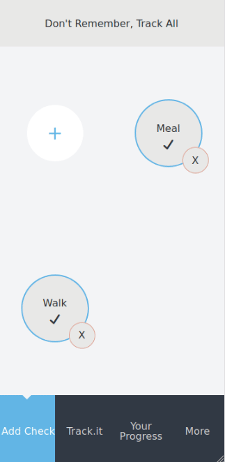

# Dr. Ti

This project is a tracking application. The project includes the basic features of

- Signing up, logging in and logging out
- Filtering tracked items, and pieces
- Checking any piece
- Listing/filtering all checking time
- Summarizing checked time visually

The app is using an [API](https://github.com/ozovalihasan/track-api).

## Live Demo
Please check [live demo of the project.](https://ozovalihasan.com/dr-ti)

## Built With

- React
- Redux Toolkit
- styled-components
- react-chartjs-2
- axios
- Jest

## Getting Started

To get a local copy up and running follow these simple example steps.

### Prerequisites

Make sure Node.js is running on your local machine.

## Setup

- Clone this repository
- Open terminal
- Change directory by using `cd track`
- Run `npm install`

### Usage

- Run `npm start`
- Open a browser and go to http://localhost:3000

## Test app

- Clone this repository
- Open terminal
- Change directory by using `cd track`
- Run `npm install`
- Run `npm test` to test all files

# Authors

Reach out to me at one of the following places!

👤 **Hasan Özovalı**

- Website: [ozovalihasan.com](https://www.ozovalihasan.com/)
- LinkedIn: [Hasan Özovalı](https://www.linkedin.com/in/hasan-ozovali/)
- Github: [@ozovalihasan](https://github.com/ozovalihasan)
- Twitter: [@ozovalihasan](https://twitter.com/ozovalihasan)
- Mail: [ozovalihasan@gmail.com](mailto:ozovalihasan@gmail.com)

## 🤝 Contributing

Contributions, issues and feature requests are welcome!

Feel free to check the [issues page](https://github.com/ozovalihasan/track/issues).

## Show your support

Give a ⭐️ if you like this project!

## Acknowledgments

Design is inspired by [work](https://www.behance.net/gallery/13271423/Bodytrackit-An-iOs-app-Branding-UX-and-UI) of [Gregoire Vella](https://www.behance.net/gregoirevella). Thanks to Gregoire Vella for the inspiration.

Thanks to;

- [Microverse Inc](https://www.microverse.org/)
 

